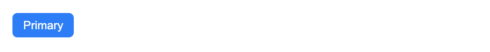

<!-- ⚠️ This README has been generated from the file(s) "/Users/wusong/Code/github-project/belleui/packages/belle-button/readme/blueprint.md" ⚠️--><h1 align="center">belleui</h1>

<p align="center">
		<a href="https://npmcharts.com/compare/@belleui/belle-button?minimal=true"></a>
<a href="https://www.npmjs.com/package/@belleui/belle-button"></a>
<a href="https://github.com/badges/shields"></a>
	</p>


[](#preview)

## Preview




[](#install)

## Install

> npm install @belleui/belle-button


[](#useage)

## Useage

```html
<section>
	<belle-button>Default</belle-button>
	<belle-button type="primary">Primary</belle-button>
	<belle-button type="success">Success</belle-button>
	<belle-button type="danger">Danger</belle-button>
	<belle-button type="warning">Warning</belle-button>
	<belle-button type="dark">Dark</belle-button>
	<belle-button type="light">Light</belle-button>
</section>
```


[](#belle-button)

# belle-button


[](#properties)

## Properties

| Property   | Attribute  | Type      | Default   | Description |
|------------|------------|-----------|-----------|-------------|
| `disabled` | `disabled` | `boolean` | false     | 是否禁用按钮      |
| `outline`  | `outline`  | `boolean` | false     | 只显示外边框      |
| `type`     | `type`     | `string`  | "default" | 按钮的类型       |


[](#slots)

## Slots

| Name | Description         |
|------|---------------------|
|      | 默认插槽，按钮文字或者其他html标签 |


[](#css-custom-properties)

## CSS Custom Properties

| Property                   | Default        | Description     |
|----------------------------|----------------|-----------------|
| `--background-color`       |                | 背景颜色            |
| `--border-color`           |                | border颜色        |
| `--border-radis`           | "6px"          | 圆角              |
| `--font-color`             |                | 按钮字体颜色          |
| `--hover-background-color` |                | hover时按钮背景颜色    |
| `--hover-border-color`     |                | hover时border的颜色 |
| `--hover-font-color`       | "--font-color" | hover时按钮的颜色     |

