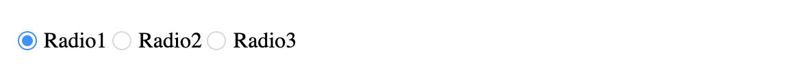

<!-- ⚠️ This README has been generated from the file(s) "/Users/wusong/Code/github-project/belleui/packages/belle-radio/readme/blueprint.md" ⚠️--><h1 align="center">belleui</h1>

		

	

## Preview

## Install

> npm install @belleui/belle-radio

## Useage

# belle-radio

## Properties

| Property   | Attribute  | Type      | Default | Description |
|------------|------------|-----------|---------|-------------|
| `checked`  | `checked`  | `boolean` | false   | 默认是否选中      |
| `disabled` | `disabled` | `boolean` | false   | 是否禁用        |
| `value`    | `value`    | `string`  | ""      | 单选框的值       |

## Methods

| Method         | Type       |
|----------------|------------|
| `handleChange` | `(): void` |

## Slots

| Name | Description         |
|------|---------------------|
|      | 默认插槽，按钮文字或者其他html标签 |

