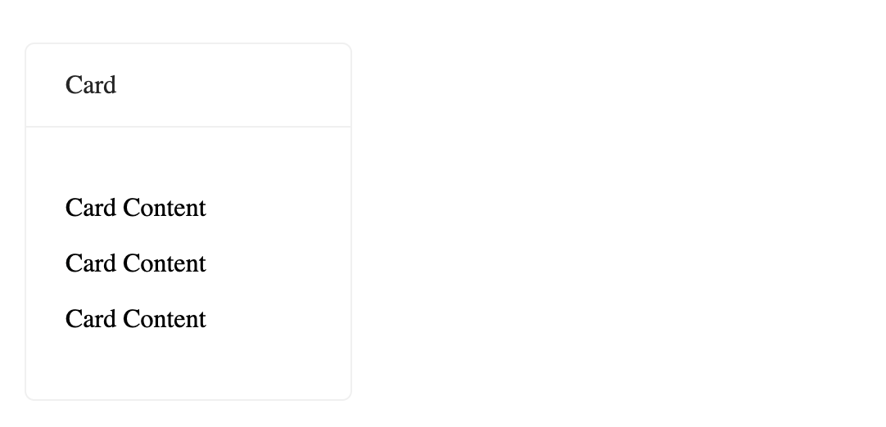

<!-- ⚠️ This README has been generated from the file(s) "/Users/wusong/Code/github-project/belleui/packages/card/readme/blueprint.md" ⚠️-->
[](#belleuibelle-card)

# @belleui/belle-card

<p>
		<a href="https://npmcharts.com/compare/@belleui/belle-card?minimal=true"></a>
<a href="https://www.npmjs.com/package/@belleui/belle-card"></a>
<a href="https://github.com/belleui/belleui/blob/master/packages/card"></a>
<a href="https://www.webcomponents.org/element/@belleui/belle-card"></a>
	</p>


[](#preview)

## Preview




[](#install)

## Install

> npm install @belleui/belle-card


[](#useage)

## Useage

```html
<belle-card title="Card">
  <div>
    <p>Card Content</p>
    <p>Card Content</p>
    <p>Card Content</p>
  </div>
</belle-card>
```
[](#properties)

## Properties

| Property | Attribute | Type     | Default | Description |
|----------|-----------|----------|---------|-------------|
| `title`  | `title`   | `string` | ""      | 标题          |

