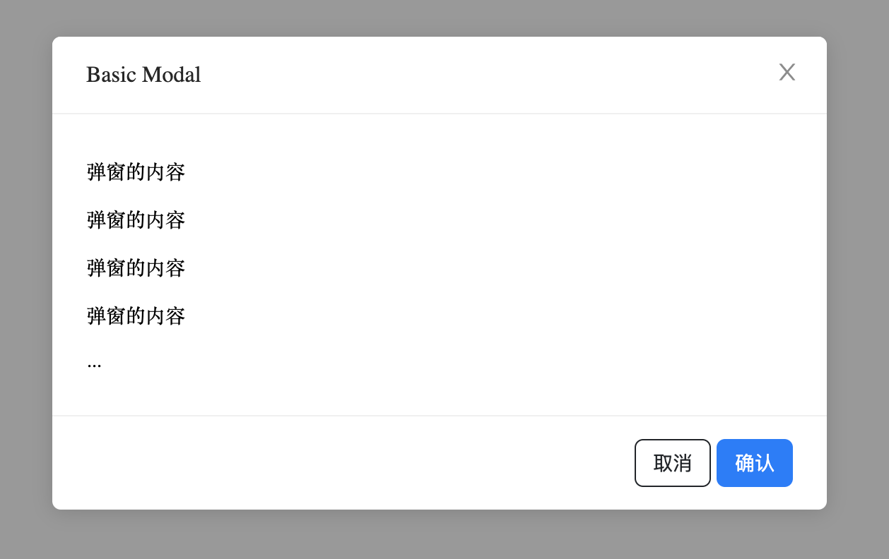

[](#belleuibelle-modal)

# @belleui/belle-modal

<p>
		<a href="https://npmcharts.com/compare/@belleui/belle-modal?minimal=true"></a>
<a href="https://www.npmjs.com/package/@belleui/belle-modal"></a>
<a href="https://github.com/belleui/belleui/blob/master/packages/modal"></a>
<a href="https://www.webcomponents.org/element/@belleui/belle-modal"></a>
	</p>

[](#preview)

## Preview




[](#install)

## Install

> npm install @belleui/belle-modal

[](#useage)

## Useage

### Basic Useage

```html
<belle-modal
  title="Basic Modal"
  .visible="${false}"
  @onOk=${handleOk}
  @onCancel=${handleCancel}
>
  <div style="width: 500px;">
    <p>弹窗的内容</p>
    <p>弹窗的内容</p>
    <p>弹窗的内容</p>
    <p>弹窗的内容</p>
    <p>...</p>
  </div>
</belle-modal>
```

[](#properties)

## Properties

| Property       | Attribute      | Type                     | Default | Description               |
|----------------|----------------|--------------------------|---------|---------------------------|
| `cancelText`   | `cancelText`   | `string`                 | "取消"    | 取消按钮文字                    |
| `closable`     | `closable`     | `boolean`                | true    | 是否显示右上角关闭按钮               |
| `footer`       | `footer`       | `TemplateResult \| null` | ""      | 自定义footer，为null时不显示footer |
| `maskClosable` | `maskClosable` | `boolean`                | true    | 是否允许点击蒙层关闭                |
| `modalMask`    |                | `HTMLElement`            |         |                           |
| `okText`       | `okText`       | `string`                 | "确认"    | 确认按钮文字                    |
| `title`        | `title`        | `string`                 | ""      | 弹窗标题                      |
| `visible`      | `visible`      | `boolean`                | false   | 是否显示弹窗                    |


[](#methods)

## Methods

| Method         | Type       |
|----------------|------------|
| `handleCancel` | `(): void` |
| `handleOk`     | `(): void` |


[](#events)

## Events

| Event      | Description    |
|------------|----------------|
| `onCancel` | 点击确定的回调函数   |
| `onOk`     | 关闭弹窗和点击取消的回调函数 |

