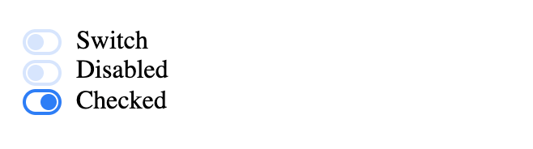

[](#belleuibelle-switch)

# @belleui/belle-switch

<p>
		<a href="https://npmcharts.com/compare/@belleui/belle-switch?minimal=true"></a>
<a href="https://www.npmjs.com/package/@belleui/belle-switch"></a>
<a href="https://github.com/belleui/belleui/blob/master/packages/switch"></a>
<a href="https://www.webcomponents.org/element/@belleui/belle-switch"></a>
	</p>


[](#preview)

## Preview



[](#install)

## Install

> npm install @belleui/belle-switch


[](#useage)

## Useage

```html
<belle-switch>Switch</belle-switch>
<belle-switch disabled>Disabled</belle-switch>
<belle-switch checked>Checked</belle-switch>
```

[](#properties)

## Properties

| Property   | Attribute  | Type      | Default | Description |
|------------|------------|-----------|---------|-------------|
| `checked`  | `checked`  | `boolean` | false   | 默认是否选中      |
| `disabled` | `disabled` | `boolean` | false   | 是否禁用        |


[](#methods)

## Methods

| Method         | Type       |
|----------------|------------|
| `handleChange` | `(): void` |


[](#events)

## Events

| Event    | Type                                 |
|----------|--------------------------------------|
| `change` | `CustomEvent<{ checked: boolean; }>` |

