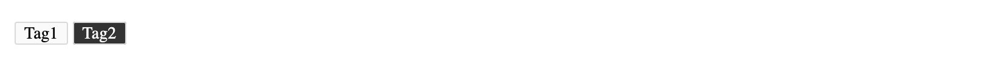

[](#belleuibelle-tag)

# @belleui/belle-tag

<p>
		<a href="https://npmcharts.com/compare/@belleui/belle-tag?minimal=true"></a>
<a href="https://www.npmjs.com/package/@belleui/belle-tag"></a>
<a href="https://github.com/belleui/belleui/blob/master/packages/tag"></a>
<a href="https://www.webcomponents.org/element/@belleui/belle-tag"></a>
	</p>


[](#preview)

## Preview




[](#install)

## Install

> npm install @belleui/belle-tag


[](#useage)

## Useage

```html
  <belle-tag>Tag1</belle-tag>
  <belle-tag color="#333">Tag2</belle-tag>
```

[](#properties)

## Properties

| Property | Attribute | Type     | Default | Description |
|----------|-----------|----------|---------|-------------|
| `color`  | `color`   | `string` | ""      | 颜色          |

